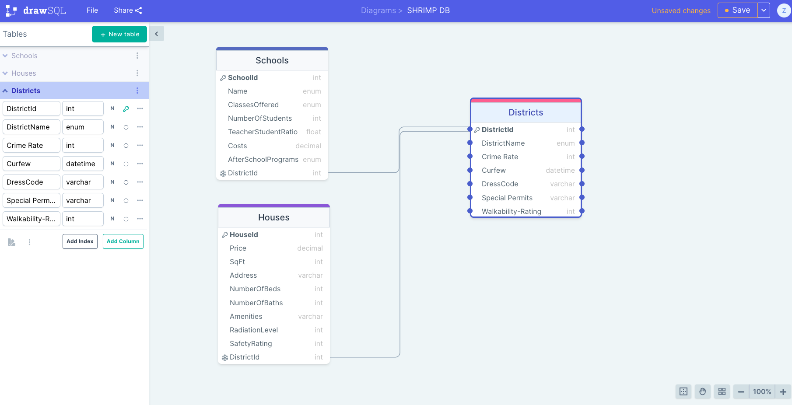

# S.H.R.I.M.P
## Table of Contents
* Introduction
* Technologies
* Packages Installed
* Database Diagram

### Introduction:
S.H.R.I.M.P is an online Realestate app designed for the post-apocalyptic world. Find the perfect home for you sorted by your favorite School or District. Discover important statistics about your new neighborhood or School. SHRIMPAPI is a Web API built in n-teir architecture layers to protect our database of imformation while allowing for maxiumum functionality. 
While our front end is under construction, we will be testing our functionality by sending requests to our endpoints through Postman. 

### Technologies:
* VisualStudio Code
* C#
* GitHub - https://github.com/zpbarrell/SHRIMP.git
* SQLServer
* Postman https://www.getpostman.com/collections/46e3760a7c74ca0abc22
* Trello - https://trello.com/b/YvPQ7gaq/operation-shrimp
* drawSQL - https://drawsql.app/teams/shrimp/diagrams/shrimp-db

### Packages Installed:
* Microsoft.EntityFrameworkCore.Design (6.0.8)
* Microsoft.EntityFrameworkCore.SqlServer (6.0.8)
* Microsoft.VisualStudio.Web.CodeGeneration.Design (6.0.8)
* Swashbuckle.AspNetCore (6.2.3)

### Diagram:

